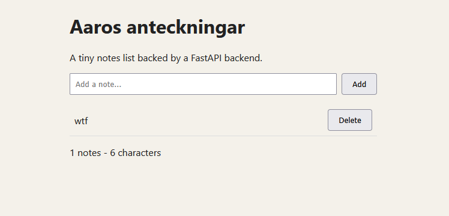
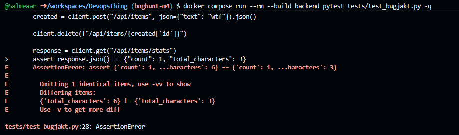
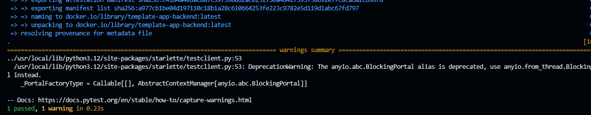

## Let the bughunt begin

1.Jag lag till antäkningen "moi" sedan "wtf", varefter jag tog bort moi.

2.Code reviewn missa p.g.a charactär totalen testades inte efter deletering av antäckning

Buggen fixades med att lägga till en rad i delete_item funktionen som tar
bort längden på antäckningen från totalen

4.För att ha undviki problemet från början borde man ha följt efter alla objekters väg till slutet