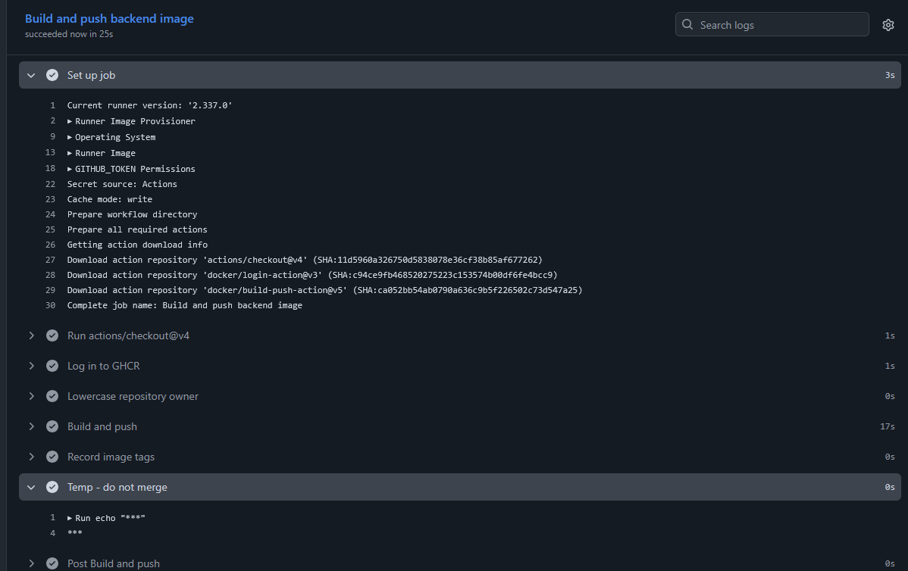

## CD images och settings

1.Til först gjorde vi ändringarna i yml file varefter jag verifierade att det aktisk fungerade på githubs sida också.

2.Efter det säkerställde vi att paketen var publika

[Screenshot där ena paketen bevisas som public](./m6-bilder/paketen-som-public.png)

3.Sedan testa vi det med att logga ut ur ghcr

4.Sedan testa vi maskeringen direkt

