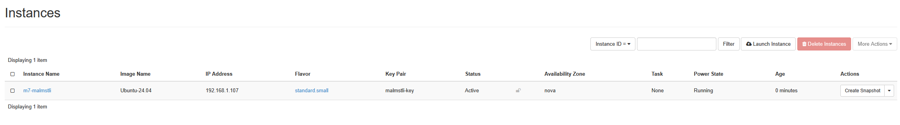
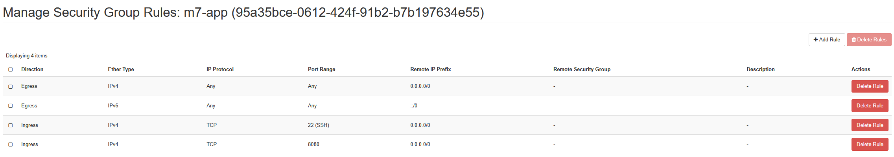
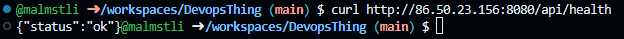
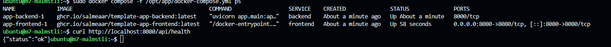
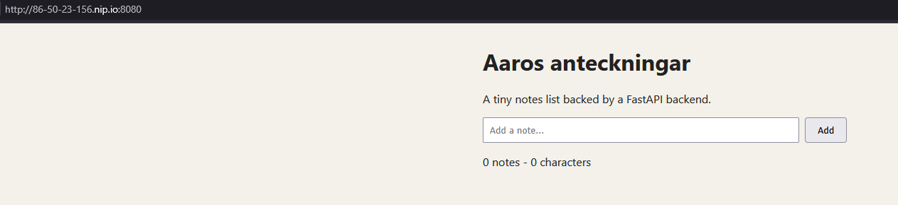

# M7 — Manually built cloud VM

## Vad jag gjorde utanför repot

skapade ssh keypair i csc openstack, använde den publika nyckeln för ubuntu instans. Skapade security group m7-app med regler för ssh port 22 och app port 8080, sedan floating ip adress. Anslöt med ssh, när jag var inne installerade jag docker och skapade docker fil samt startade frontend och backend containers.

## Bevis

### Instans och floating IP

bilden visar att det är active och running.

### Security group

Skapade security groupen m7-app, tillåter ingress trafik på portarna.

### Docker och lokal verifiering

Jag startarde med docker compose och verifierade att det körs samt endpointen svarade med status ok.

### Verifiering utifrån

från codespace körde jag curl till floating ip på port 8080 svar status ok. Appen är nåbar.

### Appen i webbläsaren

öppnade notes appen via nip.io adressen i webben bilden visar att applikationen är uppe och fungerar.

