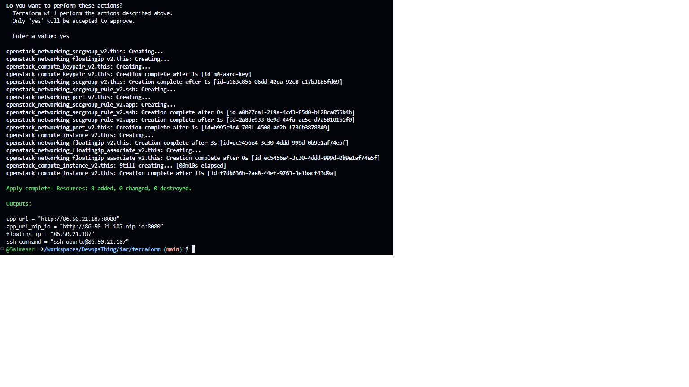
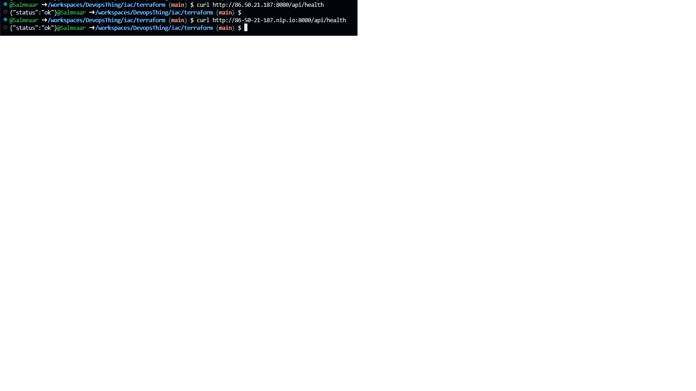
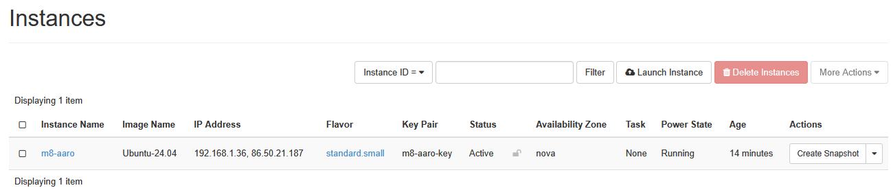
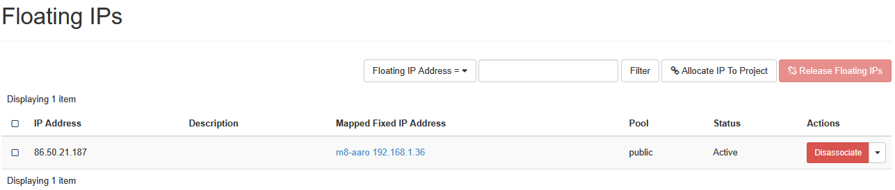
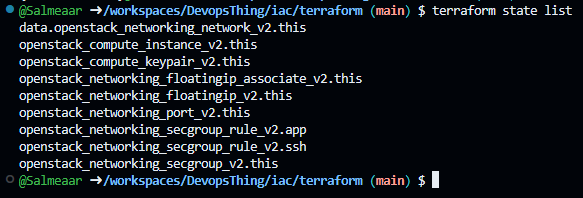
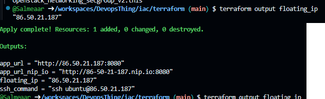

## terrafrom infran

1.Först lagade jag autentiseringen i cPouta och sedan ändrade jag värden i terraform.tfvars

2.Sedan körde jag kommandon för att checka att filen skulle vara conffad rätt(den var inte). Varefter jag körde med terraform apply

3.När jag sedan körde curl:en kom det problem d jag hade fyllt confen fel och hade stora bokstäver men efter fixen fick jag rätt

4.Steg 6 -> efter det rev jag ner den manuella VM:n

Sedan checkade jag terraforms statelist

5.Steg 8 -> jag testade terraform output floating-ip, destroya den, applya pånytt o desta samma kommando pånytt
