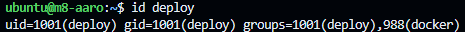
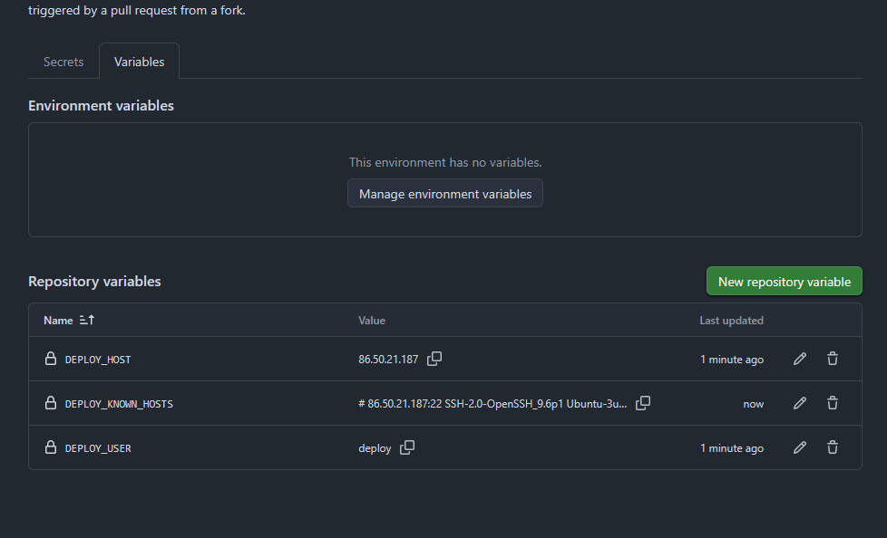
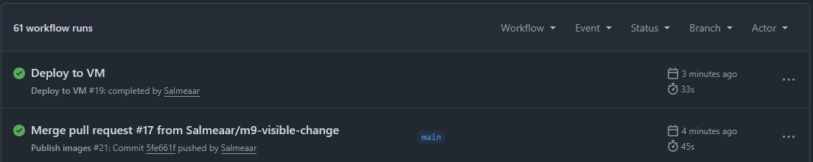
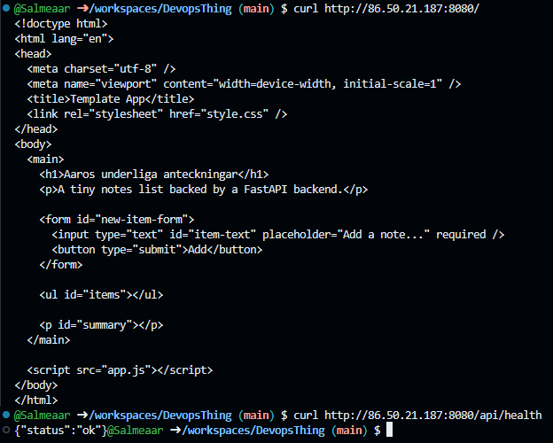

## automatisering av VM uppdatering

1.Först lagade jag ssh keyn och fixade knownhosten så allt gick till och ssh:a in till vm:n

2.Sedan gjorde jag en ny användare på vm:n med minimala rättigheter

3.Därefter testade jag nyckeln manuellt och pinnade host nyckeln

4.Vid dethär skedet lagade jag till variablerna och secretten med i repon

5.sedan körde jag sanity checken utan molnaccess och där var det inga problem

6.Till andra sist gjorde jag en synlig ändring i fråntenden då jag lag till "underliga" i h1, pushade genom hela brackle som blivit byggt och så till att den for igenom och så till tt kedjan for igenom i Actions

7.Och till sist verifiera jag utifråmn att ädnringarna faktist farit igenom hela vägen

